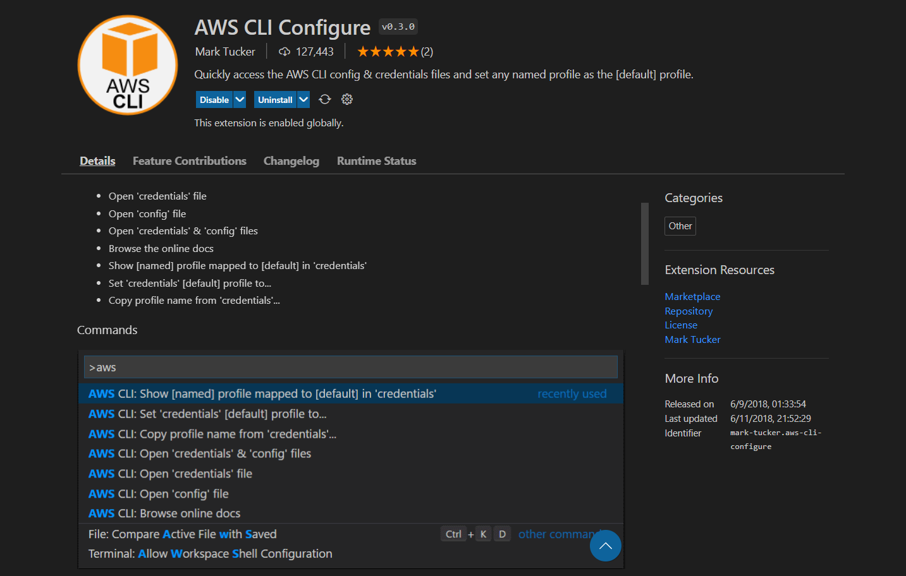

: Quick configuration with [aws cli configure](https://docs.aws.amazon.com/cli/latest/userguide/cli-configure-quickstart.html)

- `aws --version`

```cli
   aws-cli/2.7.18 Python/3.9.11 Windows/10 exe/AMD64 prompt/off
```

- `aws configure`
- `aws configure list`
- `aws sts get-caller-identity`
- `aws sts get-caller-identity --profile santosh@admin`
- `aws configure list-profiles`


<br/>



<br/>
<br/>
<h2> AWS CLI Configure for Visual Studio Code</h2>
