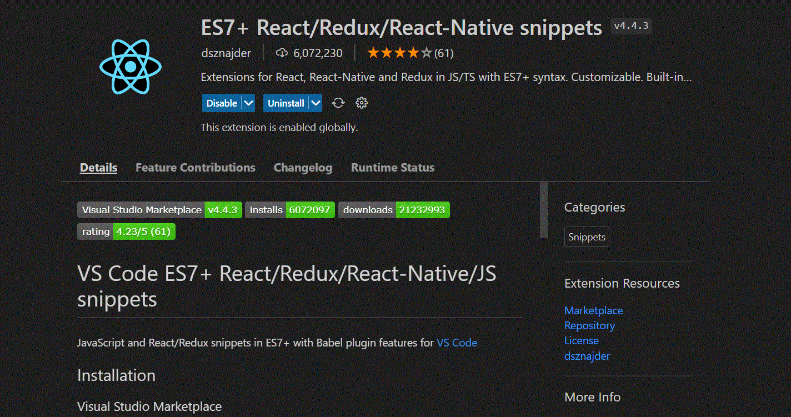

### Import React

```js
imp     → 	    import moduleName from 'module'
imn     → 	    import 'module'
imd     → 	    import { destructuredModule } from 'module'
imr     → 	    import React from 'react'
imrd    → 	    import ReactDOM from 'react-dom'
imrc    → 	    import React, { Component } from 'react'
imrpc   → 	    import React, { PureComponent } from 'react'
imrm    → 	    import React, { memo } from 'react'
imrr    → 	    import { BrowserRouter as Router, Route, NavLink} from 'react-router-dom'
imbr    → 	    import { BrowserRouter as Router} from 'react-router-dom'
imbrc   → 	    import { Route, Switch, NavLink, Link } from 'react-router-dom'
imbrr   → 	    import { Route } from 'react-router-dom'
imbrs   → 	    import { Switch } from 'react-router-dom'
imbrl   → 	    import { Link } from 'react-router-dom'
imbrnl  → 	    import { NavLink } from 'react-router-dom'
imrs    → 	    import React, { useState } from 'react'
imrse   → 	    import React, { useState, useEffect } from 'react'
```

> React Functional

```js
clg →  console.log(object)
log →  console.log()
nfn → 	const functionName = (params) => { }

useStateSnippest → const [first, setfirst] = useState(second)

// with cleanup
useEffectSnippest →

  useEffect(() => {
    first
    return () => {
      second
    }
  }, [third])

```

### React Components

```js
rfc →

import React from 'react';
export default function ListMaps() {
  return (
    <div>ListMaps</div>
  )
}

```
